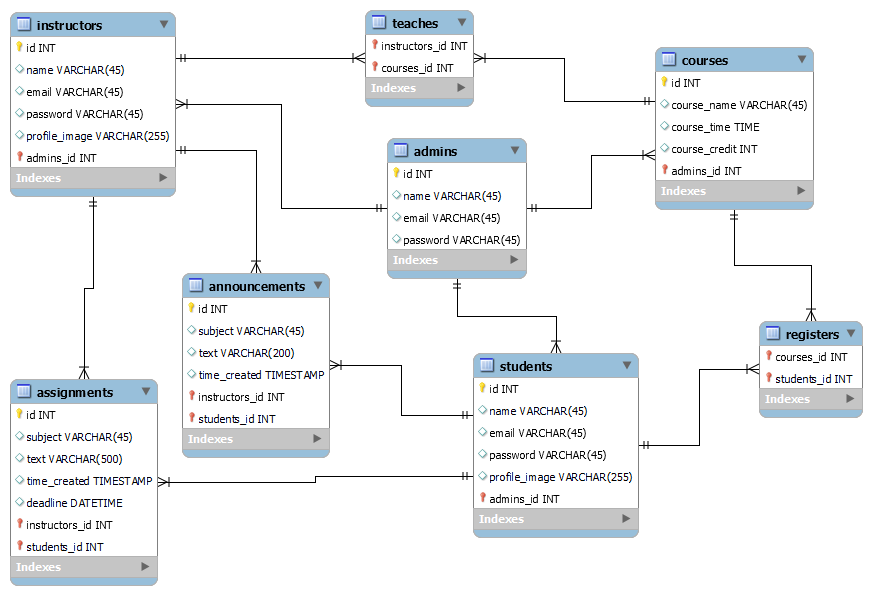

# e-learning-website
This is my e-learning website using Laravel, React and MongoDB:
The Project have three user type: Admin,Instructors and Students.
Admins shall be able to add instructors, students and courses
Admins shall be able to assign instructors to courses
Instructors shall be able to add students
Instructors shall be able to create assignments
Instructors shall be able to create announcements
Students shall be able to view and submit assignments
Students shall be able to view their enrolled.

<h2>ER Diagram </h2>

